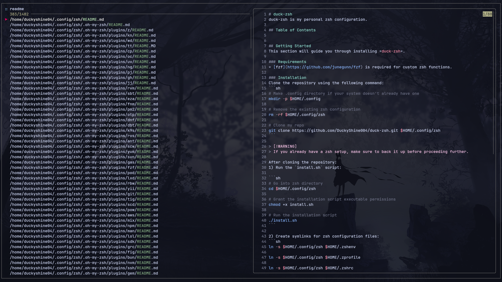
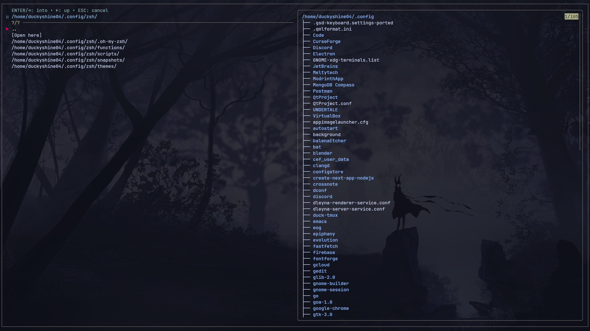
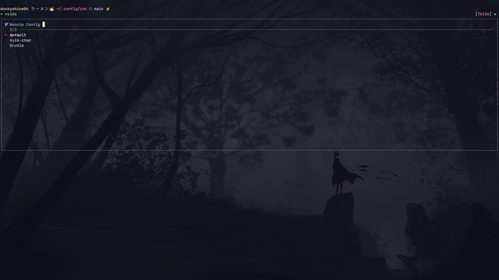
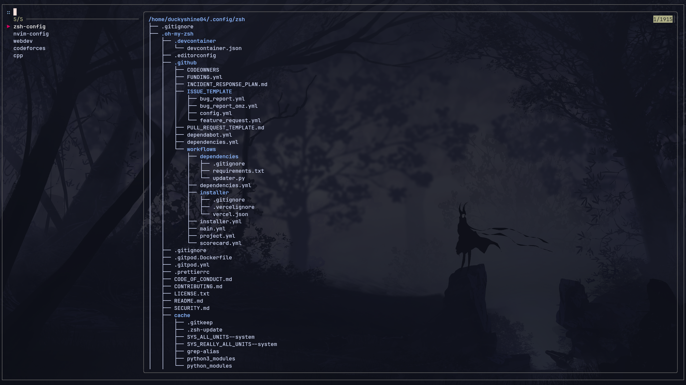

# duck-zsh
duck-zsh is my personal Zsh configuration.

## Table of Contents
- [Getting Started](#getting-started)
    - [Requirements](#requirements)
    - [Installation](#installation)
- [Plugins](#plugins)
- [Utilities](#utilities)
    - [Screenshots](#screenshots)

## Getting Started
This section will guide you through installing *duck-zsh*.

### Requirements
* [oh-my-zsh](https://ohmyz.sh/) manages your Zsh configuration.
* [fzf](https://github.com/junegunn/fzf) is required for custom Zsh functions.

### Installation
After you have met the requirements, proceed to following the installation steps.

<br>

Clone the repository using the following command:
```sh
# Make .config directory if your system doesn't already have one
mkdir -p $HOME/.config

# Remove the existing Zsh configuration
rm -rf $HOME/.config/zsh

# Clone my repo
git clone https://github.com/DuckyShine004/duck-zsh.git $HOME/.config/zsh
```

> [!WARNING]
> If you already have a Zsh setup, make sure to back it up before proceeding further. 

After cloning the repository:
1) Run the `install.sh` script:

```sh
# Go into Zsh directory
cd $HOME/.config/zsh

# Grant the installation script executable permissions
chmod +x install.sh

# Run the installation script
./install.sh
```

2) Create symlinks for Zsh configuration files:
```sh
ln -s $HOME/.config/zsh $HOME/.zshenv

ln -s $HOME/.config/zsh $HOME/.zprofile

ln -s $HOME/.config/zsh $HOME/.zshrc
```

3) Finally, source the configuration:
```sh
source $HOME/.zshrc
```

> [!NOTE]
> If sourcing fails, it's likely due to missing dependencies (e.g., `pyenv`) . Install the required packages and re-source the configuration.

## Plugins
These are the plugins I use for my Zsh configuration:
* [zsh-autosuggestions](https://github.com/zsh-users/zsh-autosuggestions)
* [zsh-vi-mode](https://github.com/jeffreytse/zsh-vi-mode)
* [zsh-syntax-highlighting](https://github.com/zsh-users/zsh-syntax-highlighting)

## Utilities
Custom functions:
* `find-file`: Recursively search through files.
* `find-directory`: Terminal file explorer.
* `nvims`: Launch different Neovim configurations (you need to configure this yourself!)
* `workspace-add`: Add a new workspace.
* `workspace-open`: Open an existing workspace.

> [!IMPORTANT]
> You must have `fzf` for these custom functions to work!

### Screenshots

#### Find File
Search through files recursively using the `find-file` command:


#### Find Directory
Navigate through your file system using the `find-directory` command:


#### Launch Neovim Configuration
Launch an existing Neovim configuration using the `nvims` command:


#### Open Workspace 
Open an existing workspace using the `workspace-open` command:

